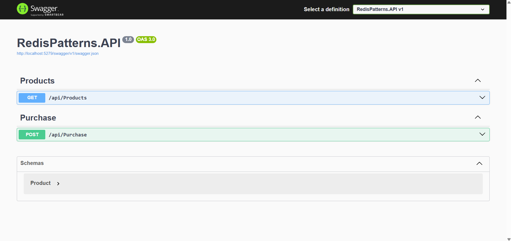
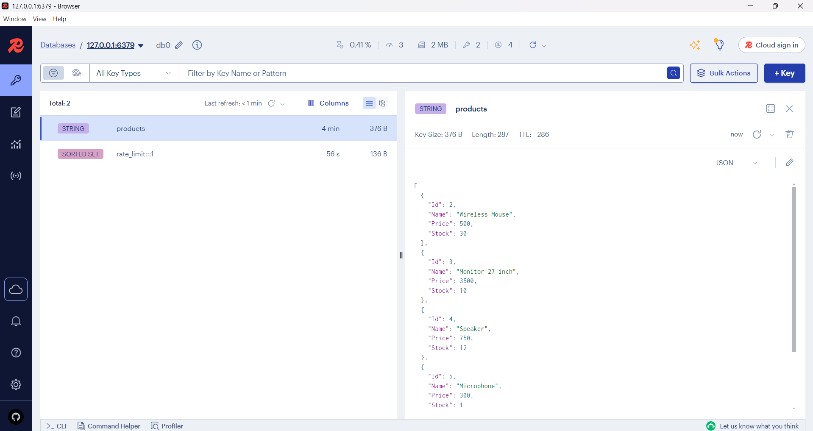

# Clean & Practical Redis Patterns in ASP.NET Core

A minimal yet professional backend application demonstrating three real-world Redis usage patterns in ASP.NET Core:

- ✅ Product listing **caching**
- ✅ **Race condition** prevention during concurrent operations
- ✅ **Rate limiting** to prevent API abuse

This project aims to go beyond basic Redis usage and showcase practical, production-like patterns with clean code and best practices.

## 🧰 Tech Stack

- **.NET 9**
- **PostgreSQL** (via Docker)
- **Redis** (via Docker)
- **StackExchange.Redis**
- **Clean Architecture-style layering**

---

## 📦 Redis Patterns Implemented

### 1. Caching

- Product list data is cached with a configurable expiration.
- Redis is used as a distributed cache to improve response time and reduce DB load.

### 2. Race Condition Prevention

- During purchase attempts, a Redis key is used as a distributed lock.
- Ensures that product stock can’t go below zero even under concurrent requests.

### 3. Rate Limiting

- Requests are limited per IP using Redis sorted sets.
- Clients exceeding the threshold receive HTTP 429 - Too Many Requests.

---

## 🚀 Getting Started

### Prerequisites

- [.NET 9 SDK](https://dotnet.microsoft.com/download)
- [Docker](https://www.docker.com/)
- [Docker Compose](https://docs.docker.com/compose/)

### Run the project

```bash
git clone https://github.com/sinanganiz/RedisPatternsInAspNetCore.git
cd RedisPatternsInAspNetCore
docker-compose up -d
dotnet run --project src/API/RedisPatterns.API
```

---

## 🧪 Test the API

### Rate Limiting Example

```bash
GET /api/Products
```

Call this endpoint more than 5 times within 1 minute to get 429 Too Many Requests.

### Caching Example

```bash
GET /api/products
```

- First request fetches from DB and caches it.
- Subsequent requests hit Redis cache.

### Purchase / Race Condition Simulation

```bash
POST /api/Purchase?productId={id}&quantity={quantity}
```

Safely decrements product stock using Redis locking.

---

## 📘 API Documentation



---

## 📊 Redis Insight Preview



---

## 🗂️ Project Structure

```bash
src/
├── API/                  → ASP.NET Core API (entry point)
├── Application/          → Interfaces and services
├── Domain/               → Entities
├── Infrastructure/       → Redis, PostgreSQL setup
docker/
└── docker-compose.yml    → Redis & PostgreSQL containers
```
